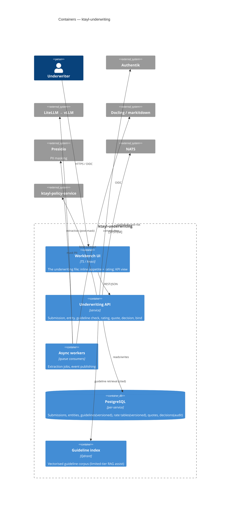
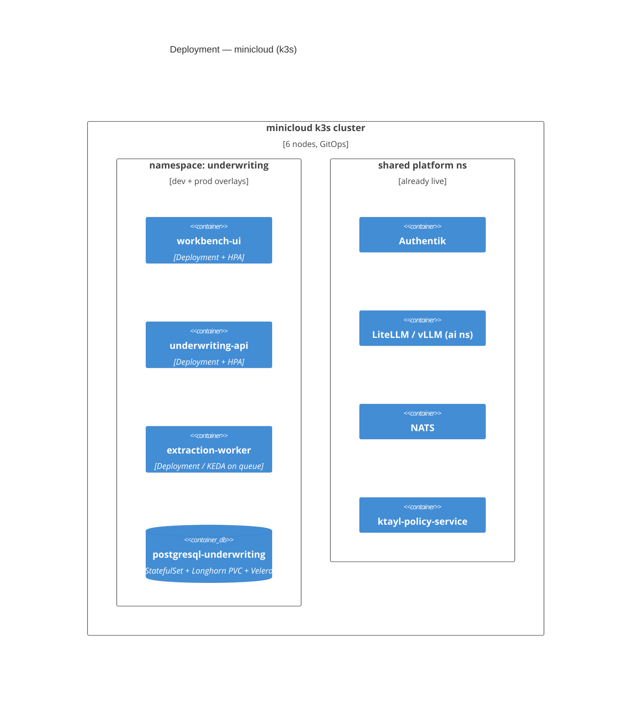

# Solution Architecture — Underwriting & Pricing (#12)

> **BMAD/SA artefact — the technical spine (index).** Path-C new-domain build. Assembles the C4 views, the
> [NFR Register](./nfr-register.md), the [Threat Model](./threat-model.md) and the [ADR log](./adr/000-index.md)
> into one set. Owner = SA/TL; approved at the **architecture spine review + security review** gates.
> **Status: DRAFT for review — no implementation has started.**

## 1. Overview

The underwriting workbench is a **modular service** (`ktayl-underwriting`) that owns the underwriting file,
guidelines, rating and decisions, and **binds into the live `ktayl-policy-service`**. It reuses the
deployed platform substrate rather than rebuilding it, and adds exactly one AI capability in v1
(human-verified submission extraction). It follows the platform's GitOps + Kargo delivery model.

**Architecture decisions of record** (full log in [ADRs](./adr/000-index.md)):
- **ADR-001** — one **modular monolith service** for v1 (not microservices); split only when a seam proves itself.
- **ADR-002** — **local entity model** now; refactor to **MDM (#20)** when a second consumer exists.
- **ADR-003** — AI is **assistive + human-verified only**; no autonomous action until the parked high-tier copilot passes its gate.
- **ADR-004** — **rate tables & guidelines are versioned, immutable, auditable** (control-library pattern).
- **ADR-005** — **Temporal** for referral/committee SLAs (deferred to UW-03, decision recorded now).
- **ADR-006** — **bind contract** to `ktayl-policy-service` is an explicit versioned API + a NATS bound-risk event.

## 2. C4 — Level 1: System Context

```mermaid
C4Context
  title System Context — Underwriting & Pricing (#12)
  Person(uw, "Underwriter", "Primary user — lives in the workbench")
  Person(broker, "Broker (external)", "Sends submissions")
  Person(compliance, "Compliance", "Sanctions/appetite screening")

  System(uwb, "ktayl-underwriting", "Underwriting workbench, guidelines, rating, decisions")

  System_Ext(pas, "ktayl-policy-service", "Policy Admin (LIVE) — bind target")
  System_Ext(idp, "Authentik", "SSO / OIDC + MFA")
  System_Ext(ai, "LiteLLM + vLLM", "AI gateway / LLM serving (extraction)")
  System_Ext(doc, "Docling / markitdown", "Document conversion / OCR")
  System_Ext(bus, "NATS", "Event backbone")
  System_Ext(down, "Reinsurance #9 / Actuarial #5", "Downstream consumers of bound risk")

  Rel(broker, uwb, "Submits risk data + documents")
  Rel(uw, uwb, "Assesses, prices, quotes, binds")
  Rel(compliance, uwb, "Screens the counterparty")
  Rel(uwb, idp, "Authenticates via OIDC")
  Rel(uwb, doc, "Converts submission docs")
  Rel(uwb, ai, "Human-verified extraction (PII masked)")
  Rel(uwb, pas, "Bind handoff (contract)")
  Rel(uwb, bus, "Publishes bound-risk events")
  Rel(bus, down, "Bound-risk consumed downstream")
```

## 3. C4 — Level 2: Containers



## 4. C4 — Level 3: Deployment



**Delivery:** GitOps (ArgoCD app-of-apps) + **Kargo** dev→prod promotion (single immutable image per
component, ghcr prod tags, Cosign + SBOM), CODEOWNERS-gated prod PR — the platform standard. Env-agnostic
images (runtime config), Authentik OIDC, ESO/Vault secrets, cert-manager TLS, default-deny NetworkPolicies
with an explicit egress allow-list (DNS + LiteLLM + Qdrant + Postgres + PAS + NATS only).

## 5. Component responsibilities

| Component | Owns | Notes |
|---|---|---|
| Workbench UI | The underwriting file, inline appetite/rating, KPI view | Primary-persona surface (task-inbox shape, not CRUD forms) |
| Underwriting API | Submission/entity/guideline/rating/quote/decision/bind | Modular monolith (ADR-001); local entity model (ADR-002) |
| Extraction worker | Doc convert → PII mask → LLM extract → human-verify queue | Limited-tier AI; never writes the file without human confirm |
| PostgreSQL | System of record incl. **immutable decision trail** + **versioned** rate tables/guidelines | ADR-004 |
| Guideline index (Qdrant) | Cited guideline retrieval | Config over code; OWUI covers free-form Q&A |

## 6. Key data flows

1. **Submission intake:** broker docs → Docling/markitdown → **Presidio mask** → LiteLLM→vLLM extraction →
   **human verification** → structured Submission in Postgres. (No unverified LLM output is persisted.)
2. **Appetite check:** submission vs versioned guidelines → in-appetite / refer / decline **+ cited reason** → file.
3. **Rating:** factor model × versioned rate table → technical premium + **explainable breakdown** → quote.
4. **Bind:** quote accepted → **bind contract → `ktayl-policy-service`** → policy issued → **NATS bound-risk event** → decision trail closed.

## 7. Cross-references

[Brief](../brief.md) · [PRD](../prd.md) · [NFR Register](./nfr-register.md) · [Threat Model](./threat-model.md) · [ADR log](./adr/000-index.md) · [FDE Playbook](../fde-underwriting-playbook.md)
