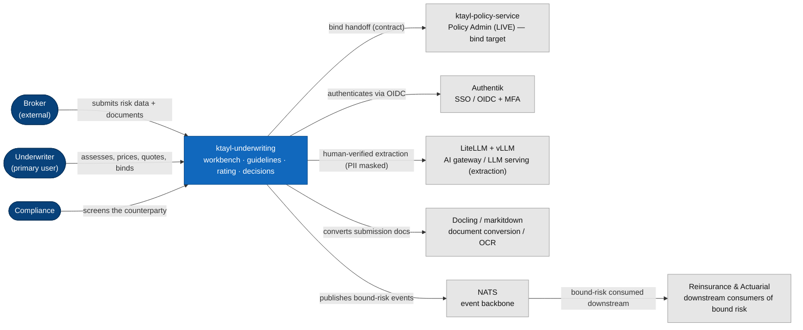
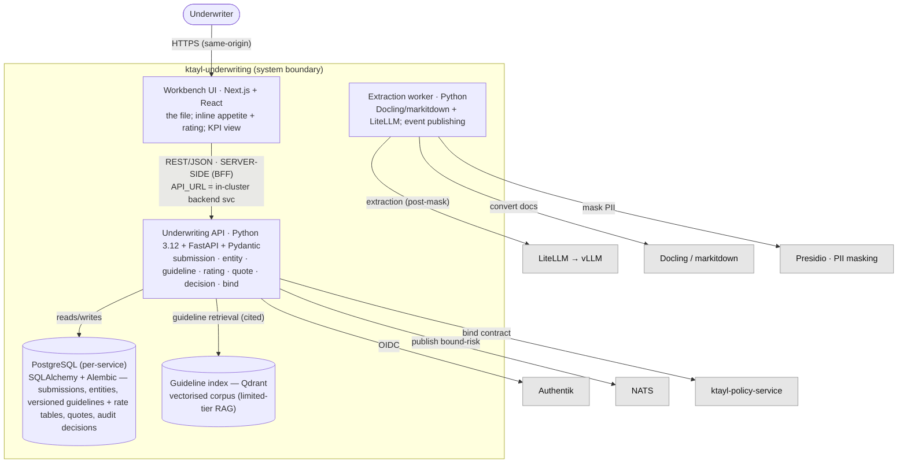
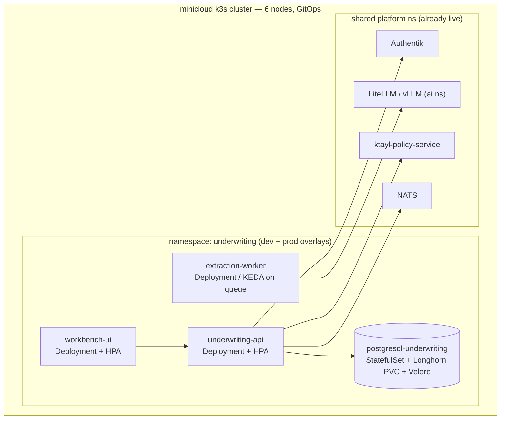

# Solution Architecture — Underwriting & Pricing (#12)

> **BMAD/SA artefact — the technical spine (index).** Path-C new-domain build. Assembles the C4 views, the
> [NFR Register](./nfr-register.md), the [Threat Model](./threat-model.md) and the [ADR log](./adr/000-index.md)
> into one set. Owner = SA/TL; approved at the **architecture spine review + security review** gates.
> **Status: the v1 thin slice (intake→appetite→rating→quote→bind) + the underwriter workbench are BUILT
> and LIVE on dev** (backend + Next.js frontend). Remaining sections describing deferred capabilities
> (extraction worker, Qdrant RAG, Temporal referral SLAs) are still forward-looking design.

## 1. Overview

The underwriting workbench is a **modular service** (`ktayl-underwriting`) that owns the underwriting file,
guidelines, rating and decisions, and **binds into the live `ktayl-policy-service`**. It reuses the
deployed platform substrate rather than rebuilding it, and adds exactly one AI capability in v1
(human-verified submission extraction). It follows the platform's GitOps + Kargo delivery model.

**Technology stack** (ADR-007 — chosen per the [stack-selection rule](https://github.com/andrelair-platform/minicloud-gitops/blob/main/.claude/rules/tech-stack-selection.md)):
**Backend = Python 3.12 + FastAPI + Pydantic** (SQLAlchemy + Alembic on Postgres; numpy/pandas for the
rate-table math; a Python extraction worker native to Docling/LiteLLM). **Frontend = Next.js + React.**
Rationale: the hard parts of this domain — numeric pricing/rating and the document-extraction pipeline —
live in Python's home ecosystem, and Pydantic gives typed API contracts.

**Architecture decisions of record** (full log in [ADRs](./adr/000-index.md)):
- **ADR-001** — one **modular monolith service** for v1 (not microservices); split only when a seam proves itself.
- **ADR-002** — **local entity model** now; refactor to **MDM (#20)** when a second consumer exists.
- **ADR-003** — AI is **assistive + human-verified only**; no autonomous action until the parked high-tier copilot passes its gate.
- **ADR-004** — **rate tables & guidelines are versioned, immutable, auditable** (control-library pattern).
- **ADR-005** — **Temporal** for referral/committee SLAs (deferred to UW-03, decision recorded now).
- **ADR-006** — **bind contract** to `ktayl-policy-service` is an explicit versioned API + a NATS bound-risk event.
- **ADR-008** — the workbench is a **Next.js BFF** (browser talks same-origin to Next; Next reaches the API server-side), in the **monorepo**, promoted by a **git-Warehouse** (both images pinned to the source commit).

## 2. C4 — Level 1: System Context

```mermaid
flowchart LR
  uw(["Underwriter<br/>(primary user)"])
  broker(["Broker<br/>(external)"])
  compliance(["Compliance"])

  uwb["ktayl-underwriting<br/>workbench · guidelines · rating · decisions"]

  pas["ktayl-policy-service<br/>Policy Admin (LIVE) — bind target"]
  idp["Authentik<br/>SSO / OIDC + MFA"]
  ai["LiteLLM + vLLM<br/>AI gateway / LLM serving (extraction)"]
  doc["Docling / markitdown<br/>document conversion / OCR"]
  bus["NATS<br/>event backbone"]
  down["Reinsurance &amp; Actuarial<br/>downstream consumers of bound risk"]

  broker -->|"submits risk data + documents"| uwb
  uw -->|"assesses, prices, quotes, binds"| uwb
  compliance -->|"screens the counterparty"| uwb
  uwb -->|"authenticates via OIDC"| idp
  uwb -->|"converts submission docs"| doc
  uwb -->|"human-verified extraction (PII masked)"| ai
  uwb -->|"bind handoff (contract)"| pas
  uwb -->|"publishes bound-risk events"| bus
  bus -->|"bound-risk consumed downstream"| down

  classDef person fill:#08427b,stroke:#052e56,color:#fff
  classDef sys fill:#1168bd,stroke:#0b4884,color:#fff
  classDef ext fill:#e6e6e6,stroke:#999,color:#111
  class uw,broker,compliance person
  class uwb sys
  class pas,idp,ai,doc,bus,down ext
```

## 3. C4 — Level 2: Containers

```mermaid
flowchart TB
  uw(["Underwriter"])

  subgraph S["ktayl-underwriting (system boundary)"]
    web["Workbench UI · Next.js + React<br/>the file; inline appetite + rating; KPI view"]
    api["Underwriting API · Python 3.12 + FastAPI + Pydantic<br/>submission · entity · guideline · rating · quote · decision · bind"]
    worker["Extraction worker · Python<br/>Docling/markitdown + LiteLLM; event publishing"]
    db[("PostgreSQL (per-service)<br/>SQLAlchemy + Alembic — submissions, entities, versioned guidelines + rate tables, quotes, audit decisions")]
    rag[("Guideline index — Qdrant<br/>vectorised corpus (limited-tier RAG)")]
  end

  idp["Authentik"]
  ai["LiteLLM → vLLM"]
  doc["Docling / markitdown"]
  pii["Presidio · PII masking"]
  bus["NATS"]
  pas["ktayl-policy-service"]

  uw -->|"HTTPS (same-origin)"| web
  web -->|"REST/JSON · SERVER-SIDE (BFF)<br/>API_URL = in-cluster backend svc"| api
  api -->|"reads/writes"| db
  api -->|"guideline retrieval (cited)"| rag
  worker -->|"convert docs"| doc
  worker -->|"mask PII"| pii
  worker -->|"extraction (post-mask)"| ai
  api -->|"OIDC"| idp
  api -->|"bind contract"| pas
  api -->|"publish bound-risk"| bus

  classDef ext fill:#e6e6e6,stroke:#999,color:#111
  class idp,ai,doc,pii,bus,pas ext
```

> **The workbench is a BFF, not a browser SPA (ADR-008).** The browser only talks **same-origin** to the
> Next.js container — reads are **server components**, writes are **server actions**. The frontend reaches
> the Underwriting API **server-side** (`API_URL` = the in-cluster backend Service, read at runtime), so the
> API is **never exposed to the browser** and the image stays env-agnostic (one artifact, dev→prod).

## 4. C4 — Level 3: Deployment

```mermaid
flowchart TB
  subgraph K["minicloud k3s cluster — 6 nodes, GitOps"]
    subgraph NS["namespace: underwriting (dev + prod overlays)"]
      web["workbench-ui<br/>Deployment + HPA"]
      api["underwriting-api<br/>Deployment + HPA"]
      worker["extraction-worker<br/>Deployment / KEDA on queue"]
      db[("postgresql-underwriting<br/>StatefulSet + Longhorn PVC + Velero")]
    end
    subgraph SH["shared platform ns (already live)"]
      idp["Authentik"]
      ai["LiteLLM / vLLM (ai ns)"]
      bus["NATS"]
      pas["ktayl-policy-service"]
    end
  end

  web --> api
  api --> db
  api --> idp
  worker --> ai
  api --> pas
  api --> bus
```

**Delivery (as built):** GitOps (ArgoCD app-of-apps) + **Kargo** dev→prod promotion, CODEOWNERS-gated prod
PR — the platform standard. The service ships **two images from one monorepo commit** (backend +
frontend), so:
- **Deployment = one dual-workload wrapper chart** — the GAP `minicloud-app-deployment` library is used
  **twice** via an aliased `frontend` dependency (one Helm render, one ArgoCD source).
- **Promotion = a git-Warehouse** (NOT two image-Warehouses): Freight = a **source commit**, and both
  `minicloud-app-deployment.image.tag` and `frontend.image.tag` are pinned to `commitFrom(...).ID[0:7]` →
  a consistent backend+frontend pair reaches each stage. Two `NewestBuild` image subs would produce
  **mixed Freight** when one image is a byte-identical cached rebuild (ADR-008).
- Env-agnostic images (runtime config), Authentik OIDC, ESO/Vault secrets, cert-manager **ECDSA** TLS
  (Vault PKI is EC-only), CNPG Postgres (self-migrating on startup), default-deny **ingress** NetworkPolicies.

> **NetworkPolicy lesson (recorded, ADR-008).** A rule gating `ingress-nginx → backend` must select the
> pod's **real** labels = the **Service selector**. The library labels the backend pod
> `app.kubernetes.io/name=minicloud-app-deployment` + `instance=<release>`, **not** `name=<release>` —
> selecting the latter matched **zero pods**, so the backend ingress **504'd** (invisible while only the
> same-namespace BFF used the backend; it also silently failed the Kargo dev-verify smoke → nothing was
> prod-promotable). The frontend→backend BFF hop is covered by the intra-namespace `allow-same-namespace` rule.

## 5. Component responsibilities

| Component | Stack | Owns | Notes |
|---|---|---|---|
| Workbench UI | **Next.js + React (BFF)** | The inbox (referral triage), submission detail (decision + explainable rating breakdown + audit), intake, assess/quote/bind actions | Primary-persona surface (task-inbox shape). **Server components + server actions**; reaches the API server-side via `API_URL` — never browser-side (ADR-008). Built + live on dev |
| Underwriting API | **Python 3.12 + FastAPI + Pydantic** | Submission/entity/guideline/rating/quote/decision/bind | Modular monolith (ADR-001); local entity model (ADR-002); rating via numpy/pandas |
| Extraction worker | **Python** | Doc convert → PII mask → LLM extract → human-verify queue | Native to Docling/LiteLLM; limited-tier AI; never writes the file without human confirm |
| PostgreSQL | **SQLAlchemy + Alembic** | System of record incl. **immutable decision trail** + **versioned** rate tables/guidelines | ADR-004 |
| Guideline index (Qdrant) | — | Cited guideline retrieval | Config over code; OWUI covers free-form Q&A |

## 6. Key data flows

1. **Submission intake:** broker docs → Docling/markitdown → **Presidio mask** → LiteLLM→vLLM extraction →
   **human verification** → structured Submission in Postgres. (No unverified LLM output is persisted.)
2. **Appetite check:** submission vs versioned guidelines → in-appetite / refer / decline **+ cited reason** → file.
3. **Rating:** factor model × versioned rate table → technical premium + **explainable breakdown** → quote.
4. **Bind:** quote accepted → **`POST /v1/policies` → `/submit` → `/activate`** on `ktayl-policy-service`
   (OIDC scope `policy:write`; deterministic `policy_number` = idempotency, `409`=no-op) → policy active →
   **NATS bound-risk event** → decision trail closed. Premium/terms stay in UW, linked by `policy_number` (ADR-006).

## 7. Cross-references

[Brief](../brief.md) · [PRD](../prd.md) · [NFR Register](./nfr-register.md) · [Threat Model](./threat-model.md) · [ADR log](./adr/000-index.md) · [FDE Playbook](../fde-underwriting-playbook.md)
