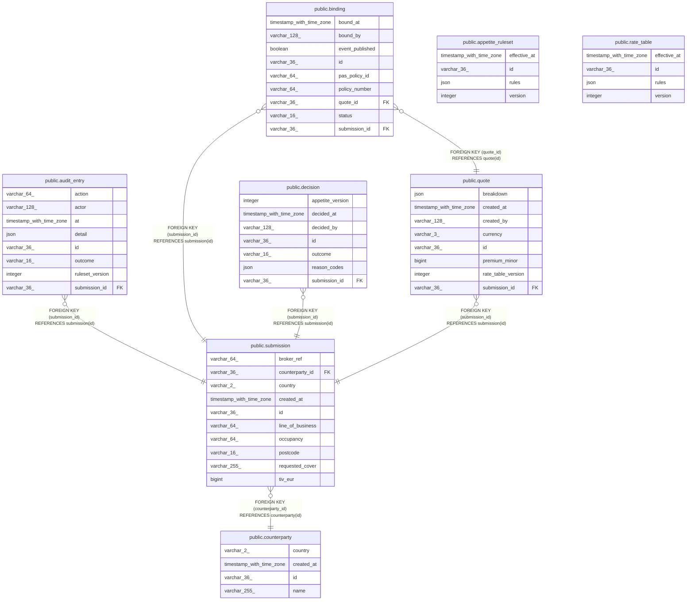

# underwriting

## Tables

| Name                                                  | Columns | Comment | Type       |
| ----------------------------------------------------- | ------- | ------- | ---------- |
| [public.appetite_ruleset](public.appetite_ruleset.md) | 4       |         | BASE TABLE |
| [public.audit_entry](public.audit_entry.md)           | 8       |         | BASE TABLE |
| [public.binding](public.binding.md)                   | 9       |         | BASE TABLE |
| [public.counterparty](public.counterparty.md)         | 4       |         | BASE TABLE |
| [public.decision](public.decision.md)                 | 7       |         | BASE TABLE |
| [public.quote](public.quote.md)                       | 8       |         | BASE TABLE |
| [public.rate_table](public.rate_table.md)             | 4       |         | BASE TABLE |
| [public.submission](public.submission.md)             | 10      |         | BASE TABLE |

## Relations

---

> Generated by [tbls](https://github.com/k1LoW/tbls)
