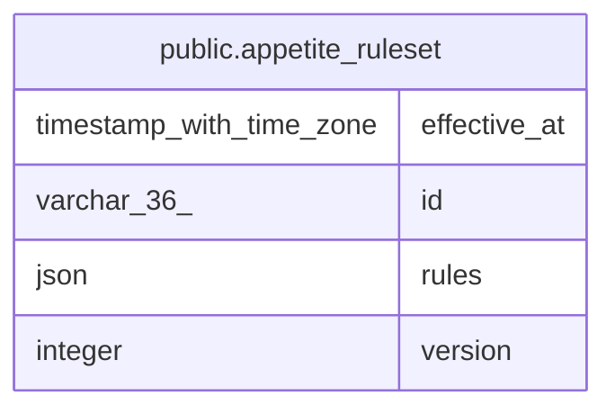

# public.appetite_ruleset

## Columns

| Name         | Type                     | Default | Nullable | Children | Parents | Comment |
| ------------ | ------------------------ | ------- | -------- | -------- | ------- | ------- |
| effective_at | timestamp with time zone |         | false    |          |         |         |
| id           | varchar(36)              |         | false    |          |         |         |
| rules        | json                     |         | false    |          |         |         |
| version      | integer                  |         | false    |          |         |         |

## Constraints

| Name                         | Type        | Definition       |
| ---------------------------- | ----------- | ---------------- |
| appetite_ruleset_pkey        | PRIMARY KEY | PRIMARY KEY (id) |
| appetite_ruleset_version_key | UNIQUE      | UNIQUE (version) |

## Indexes

| Name                         | Definition                                                                                        |
| ---------------------------- | ------------------------------------------------------------------------------------------------- |
| appetite_ruleset_pkey        | CREATE UNIQUE INDEX appetite_ruleset_pkey ON public.appetite_ruleset USING btree (id)             |
| appetite_ruleset_version_key | CREATE UNIQUE INDEX appetite_ruleset_version_key ON public.appetite_ruleset USING btree (version) |

## Relations

---

> Generated by [tbls](https://github.com/k1LoW/tbls)
