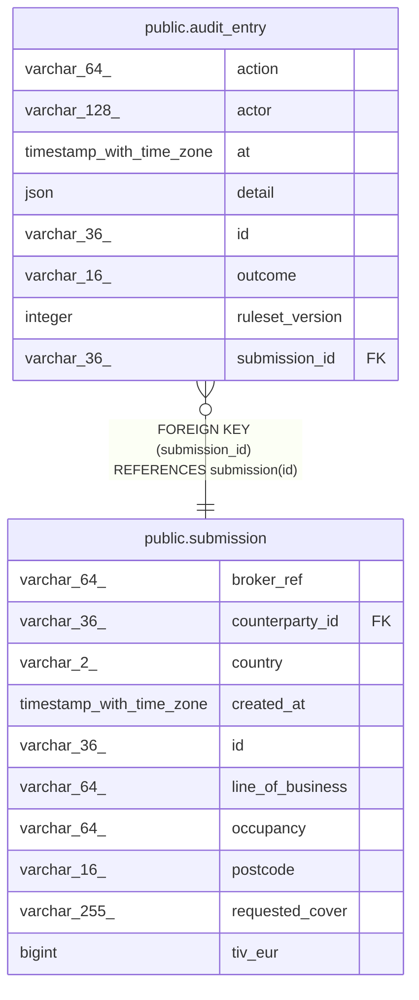

# public.audit_entry

## Columns

| Name            | Type                     | Default | Nullable | Children | Parents                                   | Comment |
| --------------- | ------------------------ | ------- | -------- | -------- | ----------------------------------------- | ------- |
| action          | varchar(64)              |         | false    |          |                                           |         |
| actor           | varchar(128)             |         | false    |          |                                           |         |
| at              | timestamp with time zone |         | false    |          |                                           |         |
| detail          | json                     |         | false    |          |                                           |         |
| id              | varchar(36)              |         | false    |          |                                           |         |
| outcome         | varchar(16)              |         | true     |          |                                           |         |
| ruleset_version | integer                  |         | true     |          |                                           |         |
| submission_id   | varchar(36)              |         | false    |          | [public.submission](public.submission.md) |         |

## Constraints

| Name                           | Type        | Definition                                            |
| ------------------------------ | ----------- | ----------------------------------------------------- |
| audit_entry_pkey               | PRIMARY KEY | PRIMARY KEY (id)                                      |
| audit_entry_submission_id_fkey | FOREIGN KEY | FOREIGN KEY (submission_id) REFERENCES submission(id) |

## Indexes

| Name                         | Definition                                                                                  |
| ---------------------------- | ------------------------------------------------------------------------------------------- |
| audit_entry_pkey             | CREATE UNIQUE INDEX audit_entry_pkey ON public.audit_entry USING btree (id)                 |
| ix_audit_entry_submission_id | CREATE INDEX ix_audit_entry_submission_id ON public.audit_entry USING btree (submission_id) |

## Relations

---

> Generated by [tbls](https://github.com/k1LoW/tbls)
