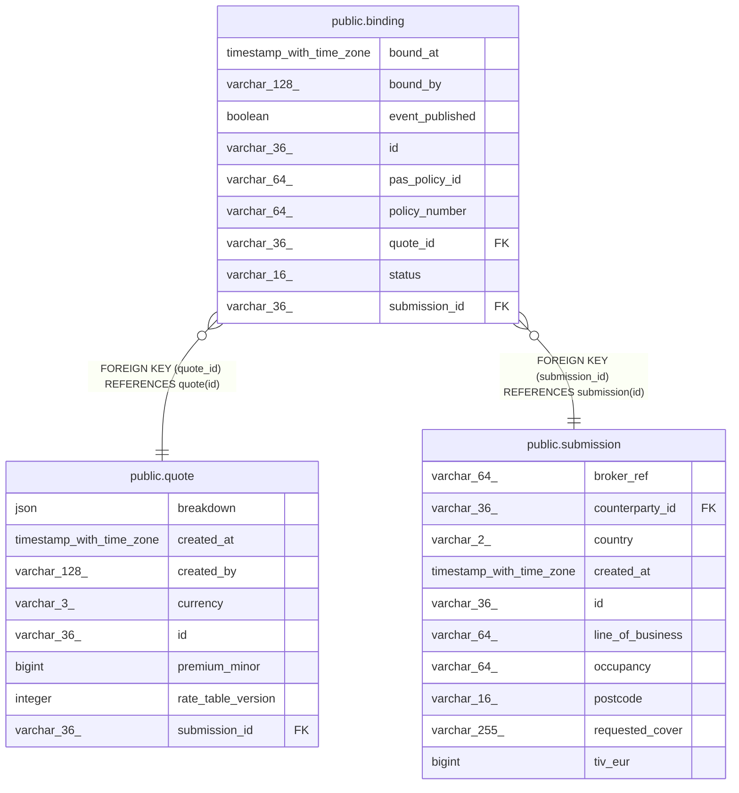

# public.binding

## Columns

| Name            | Type                     | Default | Nullable | Children | Parents                                   | Comment |
| --------------- | ------------------------ | ------- | -------- | -------- | ----------------------------------------- | ------- |
| bound_at        | timestamp with time zone |         | false    |          |                                           |         |
| bound_by        | varchar(128)             |         | false    |          |                                           |         |
| event_published | boolean                  |         | false    |          |                                           |         |
| id              | varchar(36)              |         | false    |          |                                           |         |
| pas_policy_id   | varchar(64)              |         | false    |          |                                           |         |
| policy_number   | varchar(64)              |         | false    |          |                                           |         |
| quote_id        | varchar(36)              |         | false    |          | [public.quote](public.quote.md)           |         |
| status          | varchar(16)              |         | false    |          |                                           |         |
| submission_id   | varchar(36)              |         | false    |          | [public.submission](public.submission.md) |         |

## Constraints

| Name                       | Type        | Definition                                            |
| -------------------------- | ----------- | ----------------------------------------------------- |
| binding_pkey               | PRIMARY KEY | PRIMARY KEY (id)                                      |
| binding_quote_id_fkey      | FOREIGN KEY | FOREIGN KEY (quote_id) REFERENCES quote(id)           |
| binding_submission_id_fkey | FOREIGN KEY | FOREIGN KEY (submission_id) REFERENCES submission(id) |

## Indexes

| Name                     | Definition                                                                                 |
| ------------------------ | ------------------------------------------------------------------------------------------ |
| binding_pkey             | CREATE UNIQUE INDEX binding_pkey ON public.binding USING btree (id)                        |
| ix_binding_policy_number | CREATE UNIQUE INDEX ix_binding_policy_number ON public.binding USING btree (policy_number) |
| ix_binding_quote_id      | CREATE INDEX ix_binding_quote_id ON public.binding USING btree (quote_id)                  |
| ix_binding_submission_id | CREATE UNIQUE INDEX ix_binding_submission_id ON public.binding USING btree (submission_id) |

## Relations

---

> Generated by [tbls](https://github.com/k1LoW/tbls)
