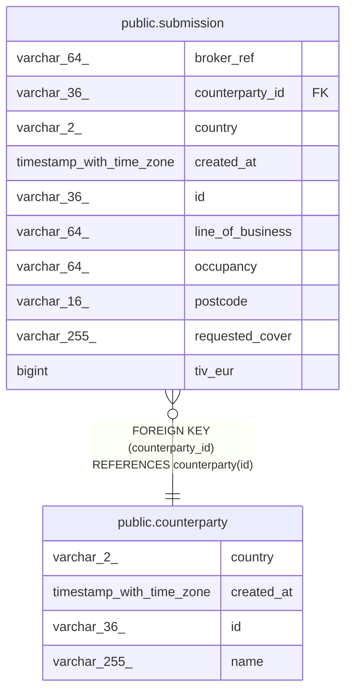

# public.counterparty

## Columns

| Name       | Type                     | Default | Nullable | Children                                  | Parents | Comment |
| ---------- | ------------------------ | ------- | -------- | ----------------------------------------- | ------- | ------- |
| country    | varchar(2)               |         | false    |                                           |         |         |
| created_at | timestamp with time zone |         | false    |                                           |         |         |
| id         | varchar(36)              |         | false    | [public.submission](public.submission.md) |         |         |
| name       | varchar(255)             |         | false    |                                           |         |         |

## Constraints

| Name              | Type        | Definition       |
| ----------------- | ----------- | ---------------- |
| counterparty_pkey | PRIMARY KEY | PRIMARY KEY (id) |

## Indexes

| Name              | Definition                                                                    |
| ----------------- | ----------------------------------------------------------------------------- |
| counterparty_pkey | CREATE UNIQUE INDEX counterparty_pkey ON public.counterparty USING btree (id) |

## Relations

---

> Generated by [tbls](https://github.com/k1LoW/tbls)
