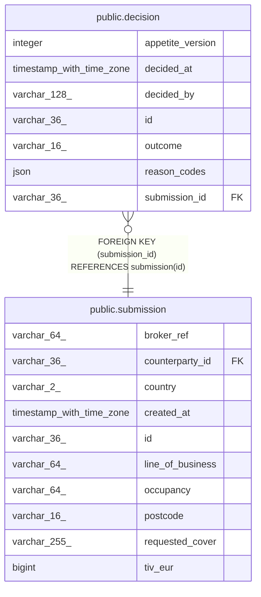

# public.decision

## Columns

| Name             | Type                     | Default | Nullable | Children | Parents                                   | Comment |
| ---------------- | ------------------------ | ------- | -------- | -------- | ----------------------------------------- | ------- |
| appetite_version | integer                  |         | false    |          |                                           |         |
| decided_at       | timestamp with time zone |         | false    |          |                                           |         |
| decided_by       | varchar(128)             |         | false    |          |                                           |         |
| id               | varchar(36)              |         | false    |          |                                           |         |
| outcome          | varchar(16)              |         | false    |          |                                           |         |
| reason_codes     | json                     |         | false    |          |                                           |         |
| submission_id    | varchar(36)              |         | false    |          | [public.submission](public.submission.md) |         |

## Constraints

| Name                        | Type        | Definition                                            |
| --------------------------- | ----------- | ----------------------------------------------------- |
| decision_pkey               | PRIMARY KEY | PRIMARY KEY (id)                                      |
| decision_submission_id_fkey | FOREIGN KEY | FOREIGN KEY (submission_id) REFERENCES submission(id) |

## Indexes

| Name                      | Definition                                                                            |
| ------------------------- | ------------------------------------------------------------------------------------- |
| decision_pkey             | CREATE UNIQUE INDEX decision_pkey ON public.decision USING btree (id)                 |
| ix_decision_submission_id | CREATE INDEX ix_decision_submission_id ON public.decision USING btree (submission_id) |

## Relations

---

> Generated by [tbls](https://github.com/k1LoW/tbls)
