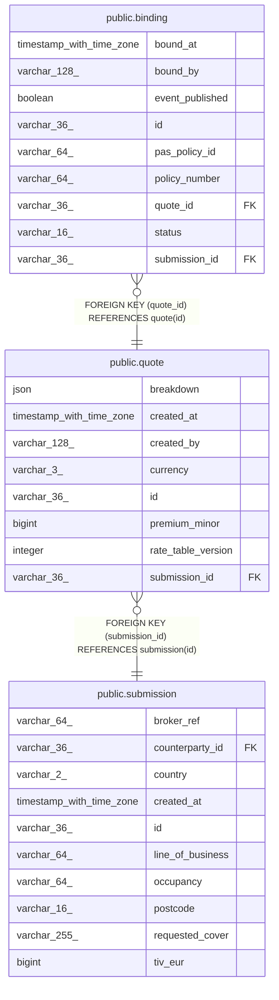

# public.quote

## Columns

| Name               | Type                     | Default | Nullable | Children                            | Parents                                   | Comment |
| ------------------ | ------------------------ | ------- | -------- | ----------------------------------- | ----------------------------------------- | ------- |
| breakdown          | json                     |         | false    |                                     |                                           |         |
| created_at         | timestamp with time zone |         | false    |                                     |                                           |         |
| created_by         | varchar(128)             |         | false    |                                     |                                           |         |
| currency           | varchar(3)               |         | false    |                                     |                                           |         |
| id                 | varchar(36)              |         | false    | [public.binding](public.binding.md) |                                           |         |
| premium_minor      | bigint                   |         | false    |                                     |                                           |         |
| rate_table_version | integer                  |         | false    |                                     |                                           |         |
| submission_id      | varchar(36)              |         | false    |                                     | [public.submission](public.submission.md) |         |

## Constraints

| Name                     | Type        | Definition                                            |
| ------------------------ | ----------- | ----------------------------------------------------- |
| quote_pkey               | PRIMARY KEY | PRIMARY KEY (id)                                      |
| quote_submission_id_fkey | FOREIGN KEY | FOREIGN KEY (submission_id) REFERENCES submission(id) |

## Indexes

| Name                   | Definition                                                                      |
| ---------------------- | ------------------------------------------------------------------------------- |
| ix_quote_submission_id | CREATE INDEX ix_quote_submission_id ON public.quote USING btree (submission_id) |
| quote_pkey             | CREATE UNIQUE INDEX quote_pkey ON public.quote USING btree (id)                 |

## Relations

---

> Generated by [tbls](https://github.com/k1LoW/tbls)
