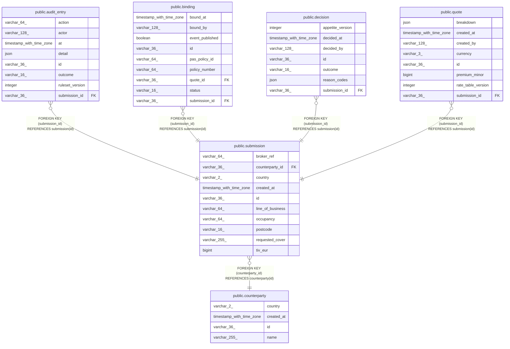

# public.submission

## Columns

| Name             | Type                     | Default | Nullable | Children                                                                                                                                              | Parents                                       | Comment |
| ---------------- | ------------------------ | ------- | -------- | ----------------------------------------------------------------------------------------------------------------------------------------------------- | --------------------------------------------- | ------- |
| broker_ref       | varchar(64)              |         | true     |                                                                                                                                                       |                                               |         |
| counterparty_id  | varchar(36)              |         | false    |                                                                                                                                                       | [public.counterparty](public.counterparty.md) |         |
| country          | varchar(2)               |         | false    |                                                                                                                                                       |                                               |         |
| created_at       | timestamp with time zone |         | false    |                                                                                                                                                       |                                               |         |
| id               | varchar(36)              |         | false    | [public.audit_entry](public.audit_entry.md) [public.binding](public.binding.md) [public.decision](public.decision.md) [public.quote](public.quote.md) |                                               |         |
| line_of_business | varchar(64)              |         | false    |                                                                                                                                                       |                                               |         |
| occupancy        | varchar(64)              |         | false    |                                                                                                                                                       |                                               |         |
| postcode         | varchar(16)              |         | false    |                                                                                                                                                       |                                               |         |
| requested_cover  | varchar(255)             |         | false    |                                                                                                                                                       |                                               |         |
| tiv_eur          | bigint                   |         | false    |                                                                                                                                                       |                                               |         |

## Constraints

| Name                            | Type        | Definition                                                |
| ------------------------------- | ----------- | --------------------------------------------------------- |
| submission_counterparty_id_fkey | FOREIGN KEY | FOREIGN KEY (counterparty_id) REFERENCES counterparty(id) |
| submission_pkey                 | PRIMARY KEY | PRIMARY KEY (id)                                          |

## Indexes

| Name            | Definition                                                                |
| --------------- | ------------------------------------------------------------------------- |
| submission_pkey | CREATE UNIQUE INDEX submission_pkey ON public.submission USING btree (id) |

## Relations

---

> Generated by [tbls](https://github.com/k1LoW/tbls)
